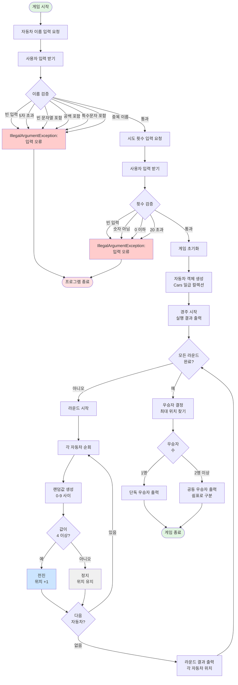
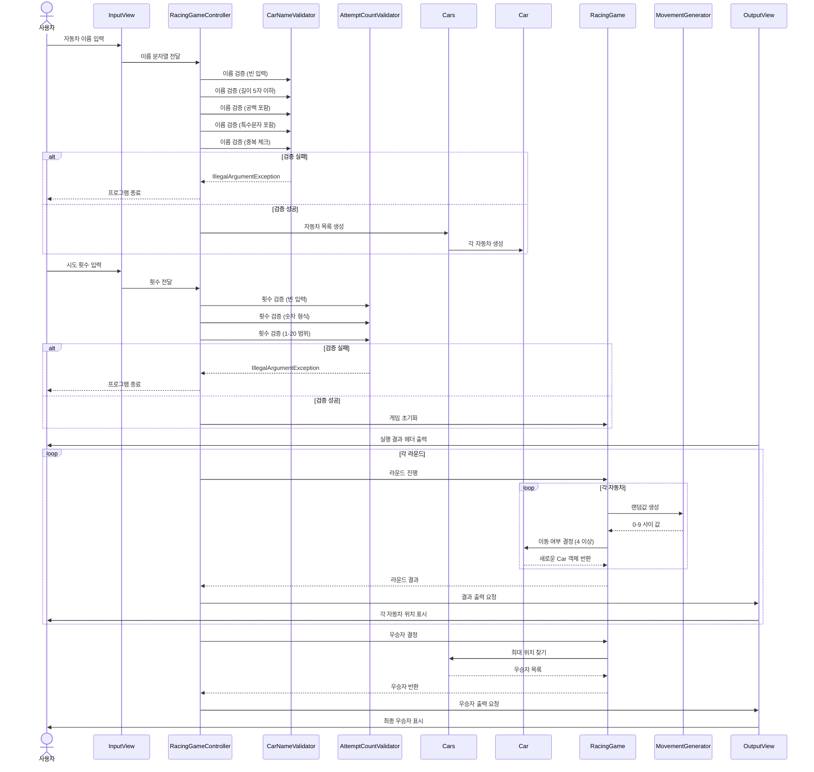
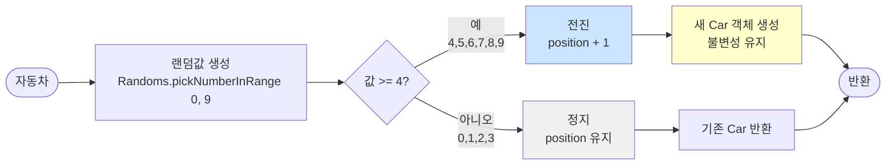
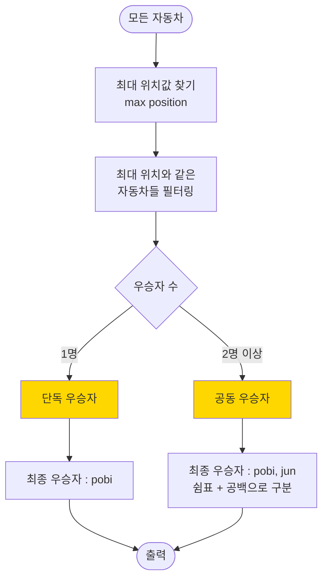

<div align="center">


</div>

<br>

## 📋 프로젝트 개요

### 🎯 목표
주어진 횟수 동안 n대의 자동차가 전진 또는 멈추는 경주 게임을 구현하며, **객체지향 설계 원칙**과 **테스트 가능한 코드**를 작성한다.

### 🏗️ 설계 의도

**1. 계층 분리 (MVC 패턴)**
- `View`: 사용자 입출력만 담당 (`InputView`, `OutputView`)
- `Controller`: 전체 흐름 제어 및 계층 간 연결 (`RacingGameController`)
- `Domain`: 핵심 비즈니스 로직 (`Car`, `Cars`, `RacingGame`, `Validator`)

**2. 단일 책임 원칙 (SRP)**
- `CarNameValidator`: 자동차 이름 검증만 담당
- `AttemptCountValidator`: 시도 횟수 검증만 담당
- `MovementGenerator`: 전진 여부 결정만 담당
- 각 클래스는 **하나의 변경 이유**만 가짐

**3. 일급 컬렉션 활용**
- `Cars` 클래스로 자동차 목록을 감싸서 관리
- 컬렉션 관련 비즈니스 로직(우승자 찾기, 이동 처리)을 `Cars`에 집중
- 외부에서 내부 컬렉션을 직접 조작하지 못하도록 캡슐화

**4. 불변 객체 설계**
- `Car` 객체는 이동 시 새로운 객체를 반환 (기존 객체 상태 변경 없음)
- 모든 필드를 `final`로 선언하여 불변성 보장
- 예측 가능한 동작과 부작용(side effect) 방지

**5. 테스트 가능한 구조**
- `MovementGenerator`를 인터페이스로 분리하여 랜덤값 테스트 가능
- 각 계층을 독립적으로 테스트 가능
- 검증 로직을 Validator로 분리하여 단위 테스트 용이

### ⚙️ 실행 흐름
```
1. 사용자 입력
   ├─ 자동차 이름 입력 (쉼표 구분)
   └─ 시도 횟수 입력

2. 입력 검증
   ├─ CarNameValidator: 이름 검증 (길이, 공백, 특수문자, 중복)
   └─ AttemptCountValidator: 횟수 검증 (빈 입력, 숫자 형식, 범위)

3. 게임 초기화
   ├─ Cars 일급 컬렉션 생성
   └─ RacingGame 객체 생성 (히스토리 관리)

4. 경주 진행 (라운드 반복)
   ├─ 각 자동차마다 랜덤값 생성 (0~9)
   ├─ 4 이상이면 전진 (새 Car 객체 반환)
   ├─ 라운드 결과를 히스토리에 저장
   └─ 현재 라운드 상태 출력

5. 우승자 결정
   ├─ Cars에서 최대 위치 찾기
   ├─ 최대 위치와 같은 자동차들 필터링
   └─ 단독/공동 우승자 출력
```

<br>

## ✨ 기능 요구 사항

> **게임 규칙**
> - 주어진 횟수 동안 n대의 자동차는 전진 또는 멈출 수 있다.
> - 각 자동차에 이름을 부여할 수 있다. 전진하는 자동차를 출력할 때 자동차 이름을 같이 출력한다.
> - 자동차 이름은 쉼표(`,`)를 기준으로 구분하며 이름은 5자 이하만 가능하다.
> - 사용자는 몇 번의 이동을 할 것인지를 입력할 수 있어야 한다.
> - 전진하는 조건은 0에서 9 사이에서 무작위 값을 구한 후 무작위 값이 4 이상일 경우이다.
> - 자동차 경주 게임을 완료한 후 누가 우승했는지를 알려준다. 우승자는 한 명 이상일 수 있다.
> - 우승자가 여러 명일 경우 쉼표(`,`)를 이용하여 구분한다.

> **예외 처리**
>
> **자동차 이름 입력 검증**
> - **빈 입력**: 아무것도 입력하지 않은 경우 `IllegalArgumentException` 발생
> - **이름 길이 초과**: 이름이 5자를 초과하는 경우 `IllegalArgumentException` 발생
> - **빈 문자열**: 빈 문자열이 포함된 경우 (예: `"pobi,,jun"`) `IllegalArgumentException` 발생
> - **공백 포함**: 이름에 공백(띄어쓰기, 탭 등)이 포함된 경우 (예: `"po bi"`) `IllegalArgumentException` 발생
> - **특수문자 포함**: 한글, 영문, 숫자를 제외한 특수문자가 포함된 경우 `IllegalArgumentException` 발생
> - **중복 이름**: 중복된 자동차 이름이 있는 경우 (대소문자 구분) `IllegalArgumentException` 발생
>
> **시도 횟수 입력 검증**
> - **빈 입력**: 아무것도 입력하지 않은 경우 `IllegalArgumentException` 발생
> - **숫자가 아닌 값**: 시도 횟수에 숫자가 아닌 값이 입력된 경우 `IllegalArgumentException` 발생
> - **0 이하의 값**: 0 이하의 값이 입력된 경우 `IllegalArgumentException` 발생
> - **상한값 초과**: 20을 초과하는 값이 입력된 경우 `IllegalArgumentException` 발생
>
> ⚠️ 예외 발생 시 애플리케이션은 종료되어야 한다.

<br>

---

## 🎮 게임 로직 플로우

### 📊 전체 게임 플로우차트



### 🔄 계층별 상호작용 (시퀀스 다이어그램)



### 🏎️ 자동차 이동 결정 로직



### 🏆 우승자 결정 로직



<br>

---

## 🏗️ 프로젝트 구조 설계

### 📦 패키지 구조
```
racingcar/
├── Application.java           (메인 실행)
├── controller/                (흐름 제어)
│   └── RacingGameController.java  (전체 실행 흐름 제어)
├── domain/                    (비즈니스 로직)
│   ├── Car.java               (개별 자동차)
│   ├── RacingGame.java        (경주 게임 전체 관리)
│   ├── Cars.java              (자동차 일급 컬렉션)
│   ├── CarNameValidator.java (자동차 이름 검증)
│   ├── AttemptCountValidator.java (시도 횟수 검증)
│   ├── MovementGenerator.java (전진 여부 결정)
│   └── ErrorMessages.java     (에러 메시지 상수)
└── view/                      (입출력)
    ├── InputView.java         (사용자 입력 처리)
    └── OutputView.java        (결과 출력 처리)
```

### 🎯 클래스 역할 및 책임

**\`Application\`**
- 프로그램의 시작점
- Controller를 생성하고 실행

**\`controller/RacingGameController\`**
- 전체 실행 흐름 제어 (의존성 관리)
- View와 Domain 계층 연결
- 입력 → 게임 초기화 → 경주 진행 → 우승자 결정 → 출력 흐름 관리

**\`domain/Car\`**
- 개별 자동차의 상태 관리 (이름, 위치)
- 전진 로직 수행
- 불변성 유지 (위치 변경 시 새 객체 반환)

**\`domain/RacingGame\`**
- 경주 게임 전체 진행 로직
- 라운드별 자동차 이동 처리
- 라운드별 상태 히스토리 관리
- 우승자 결정

**\`domain/Cars\`**
- 자동차 목록 일급 컬렉션
- 자동차 생성 및 관리
- 우승자 필터링

**\`domain/CarNameValidator\`**
- 자동차 이름 유효성 검증
- 이름 길이 체크 (5자 이하)
- 빈 문자열, 공백 포함 체크
- 특수문자 포함 체크 (한글/영문/숫자만 허용)
- 중복 이름 체크

**\`domain/AttemptCountValidator\`**
- 시도 횟수 유효성 검증
- 빈 입력 체크
- 숫자 형식 검증
- 범위 검증 (1 이상 20 이하)

**\`domain/MovementGenerator\`**
- 전진 여부 결정 로직
- \`Randoms.pickNumberInRange(0, 9)\` 활용
- 4 이상일 때 전진

**\`domain/ErrorMessages\`**
- 모든 에러 메시지 상수 중앙 관리
- 중복 제거 및 일관성 유지

**\`view/InputView\`**
- 자동차 이름 입력 안내 및 받기
- 시도 횟수 입력 안내 및 받기
- \`Console.readLine()\`을 통한 입력 처리

**\`view/OutputView\`**
- 각 라운드 실행 결과 출력
- 최종 우승자 출력
- 형식에 맞춘 출력 처리

<br>

---

## 📝 구현할 기능 목록

### 1️⃣ 입력 처리 (\`InputView\`)
- [x] "경주할 자동차 이름을 입력하세요.(이름은 쉼표(,) 기준으로 구분)" 출력
- [x] 자동차 이름 문자열 입력 받기 (\`Console.readLine()\` 사용)
- [x] "시도할 횟수는 몇 회인가요?" 출력
- [x] 시도 횟수 입력 받기 (\`Console.readLine()\` 사용)

### 2️⃣ 자동차 이름 검증 (\`CarNameValidator\`)
- [ ] 빈 입력 검증 (아무것도 입력하지 않은 경우)
- [ ] 빈 입력 시 \`IllegalArgumentException\` 발생
- [ ] 자동차 이름이 5자 이하인지 검증
- [ ] 이름이 5자를 초과하면 \`IllegalArgumentException\` 발생
- [ ] 빈 문자열 이름 검증 (예: "pobi,,jun")
- [ ] 빈 문자열이 있으면 \`IllegalArgumentException\` 발생
- [ ] 이름에 공백(띄어쓰기, 탭 등) 포함 검증
- [ ] 공백이 포함되면 \`IllegalArgumentException\` 발생
- [ ] 특수문자 포함 검증 (한글/영문/숫자만 허용)
- [ ] 특수문자가 포함되면 \`IllegalArgumentException\` 발생
- [ ] 중복된 자동차 이름 검증 (대소문자 구분)
- [ ] 중복 이름이 있으면 \`IllegalArgumentException\` 발생

### 3️⃣ 자동차 생성 및 관리 (\`Cars\`, \`Car\`)
- [ ] 쉼표(\`,\`)를 기준으로 자동차 이름 분리
- [ ] 각 이름으로 \`Car\` 객체 생성
- [ ] 자동차 목록을 일급 컬렉션으로 관리
- [ ] 자동차 초기 위치는 0

### 4️⃣ 시도 횟수 검증 (\`AttemptCountValidator\`)
- [ ] 빈 입력 검증 (아무것도 입력하지 않은 경우)
- [ ] 빈 입력 시 \`IllegalArgumentException\` 발생
- [ ] 입력값이 숫자인지 검증
- [ ] 숫자가 아니면 \`IllegalArgumentException\` 발생
- [ ] 0 이하의 값 검증
- [ ] 0 이하이면 \`IllegalArgumentException\` 발생
- [ ] 20 초과 값 검증
- [ ] 20 초과이면 \`IllegalArgumentException\` 발생

### 5️⃣ 경주 진행 (\`RacingGame\`, \`MovementGenerator\`)
- [ ] 주어진 횟수만큼 라운드 반복
- [ ] 각 라운드마다 모든 자동차에 대해:
  - [ ] 0~9 사이의 무작위 값 생성 (\`Randoms.pickNumberInRange(0, 9)\`)
  - [ ] 값이 4 이상이면 전진
  - [ ] 값이 4 미만이면 정지
- [ ] 각 라운드 결과를 반환

### 6️⃣ 우승자 결정 (\`RacingGame\`, \`Cars\`)
- [ ] 모든 자동차 중 최대 이동 거리 찾기
- [ ] 최대 이동 거리를 가진 자동차들을 우승자로 결정
- [ ] 우승자가 여러 명일 경우 리스트로 반환

### 7️⃣ 출력 처리 (\`OutputView\`)
- [x] 빈 줄 출력 후 "실행 결과" 출력
- [x] 각 라운드별 실행 결과 출력
  - [x] 형식: \`자동차이름 : -\` (이동 거리만큼 \`-\` 출력)
  - [x] 각 자동차마다 한 줄씩 출력
  - [x] 라운드 사이에 빈 줄 추가
- [x] 최종 우승자 출력
  - [x] 단독 우승: \`최종 우승자 : pobi\`
  - [x] 공동 우승: \`최종 우승자 : pobi, jun\` (쉼표와 공백으로 구분)

### 8️⃣ 전체 흐름 (\`RacingGameController\`)
- [ ] 자동차 이름 입력 받기
- [ ] 자동차 이름 유효성 검증
- [ ] 자동차 객체 생성
- [ ] 시도 횟수 입력 받기
- [ ] 시도 횟수 유효성 검증
- [ ] 경주 게임 초기화
- [ ] 경주 진행 및 각 라운드 결과 출력
- [ ] 우승자 결정 및 출력
- [ ] 예외 발생 시 애플리케이션 종료

<br>

---

## 🚀 보다 구체화된 구현 목록 (선택)

<details>
<summary><b>1️⃣ 불변 객체 설계</b></summary>

**Car 불변성**
- [ ] Car 필드를 \`final\`로 선언
- [ ] 위치 변경 시 새로운 Car 객체 반환
- [ ] getter만 제공 (setter 없음)

**Cars 불변성**
- [ ] 내부 리스트를 불변 리스트로 관리
- [ ] 방어적 복사 적용

</details>

<details>
<summary><b>2️⃣ 테스트 코드 작성</b></summary>

**Car 테스트**
- [ ] 자동차 생성 테스트
- [ ] 전진 테스트
- [ ] 위치 조회 테스트

**Cars 테스트**
- [ ] 자동차 이름 목록으로 생성 테스트
- [ ] 우승자 필터링 테스트
- [ ] 빈 이름 예외 테스트
- [ ] 이름 길이 초과 예외 테스트

**RacingGame 테스트**
- [ ] 경주 진행 테스트
- [ ] 우승자 결정 테스트 (단독)
- [ ] 우승자 결정 테스트 (공동)

**CarNameValidator 테스트**
- [ ] 유효한 이름 검증 테스트
- [ ] 5자 초과 예외 테스트
- [ ] 빈 문자열 예외 테스트

**MovementGenerator 테스트**
- [ ] 전진 조건 테스트 (4 이상)
- [ ] 정지 조건 테스트 (4 미만)

</details>

<details>
<summary><b>3️⃣ 일급 컬렉션 활용</b></summary>

- [ ] Cars 클래스로 자동차 목록 래핑
- [ ] 컬렉션 관련 비즈니스 로직 집중
- [ ] 불변성 보장
- [ ] 의미 있는 메서드 제공 (우승자 필터링 등)

</details>

<details>
<summary><b>4️⃣ 랜덤 값 테스트 전략</b></summary>

- [ ] \`MovementGenerator\` 인터페이스화
- [ ] 테스트용 고정값 생성기 구현
- [ ] 프로덕션용 랜덤 생성기 구현
- [ ] 의존성 주입을 통한 테스트 용이성 확보

</details>

<br>

---

## 💻 실행 결과 예시

### ✅ 정상 실행 (단독 우승)
```
경주할 자동차 이름을 입력하세요.(이름은 쉼표(,) 기준으로 구분)
pobi,woni,jun
시도할 횟수는 몇 회인가요?
5

실행 결과
pobi : -
woni :
jun : -

pobi : --
woni : -
jun : --

pobi : ---
woni : --
jun : ---

pobi : ----
woni : ---
jun : ----

pobi : -----
woni : ----
jun : -----

최종 우승자 : pobi
```

### ✅ 정상 실행 (공동 우승)
```
경주할 자동차 이름을 입력하세요.(이름은 쉼표(,) 기준으로 구분)
pobi,woni,jun
시도할 횟수는 몇 회인가요?
5

실행 결과
pobi : -
woni :
jun : -

pobi : --
woni : -
jun : --

pobi : ---
woni : --
jun : ---

pobi : ----
woni : ---
jun : ----

pobi : -----
woni : ----
jun : -----

최종 우승자 : pobi, jun
```

### ❌ 예외 발생 (이름 길이 초과)
```
경주할 자동차 이름을 입력하세요.(이름은 쉼표(,) 기준으로 구분)
pobi,javaji,jun
Exception in thread "main" java.lang.IllegalArgumentException: 자동차 이름은 5자 이하여야 합니다.
```

### ❌ 예외 발생 (잘못된 시도 횟수)
```
경주할 자동차 이름을 입력하세요.(이름은 쉼표(,) 기준으로 구분)
pobi,woni,jun
시도할 횟수는 몇 회인가요?
0
Exception in thread "main" java.lang.IllegalArgumentException: 시도 횟수는 1 이상이어야 합니다.
```

<br>

---

## ⚙️ 프로그래밍 요구 사항

| 항목 | 요구 사항 |
|------|-----------|
| **JDK 버전** | JDK 21 |
| **시작점** | \`Application\`의 \`main()\` |
| **빌드 설정** | \`build.gradle\` 변경 금지 |
| **외부 라이브러리** | 제공된 라이브러리 외 사용 금지 |
| **종료 처리** | \`System.exit()\` 사용 금지 |
| **코드 스타일** | Java Style Guide |
| **들여쓰기** | depth 3 이하 (2까지만 허용) |
| **3항 연산자** | 사용 금지 |
| **함수 길이** | 한 가지 일만 하도록 최대한 작게 |
| **입력 처리** | \`camp.nextstep.edu.missionutils.Console.readLine()\` 사용 |
| **랜덤 값** | \`camp.nextstep.edu.missionutils.Randoms.pickNumberInRange(0, 9)\` 사용 |
| **테스트** | JUnit 5와 AssertJ 사용 |

<br>


<div align="center">


</div>
