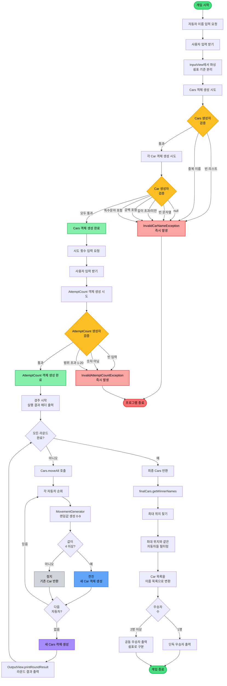
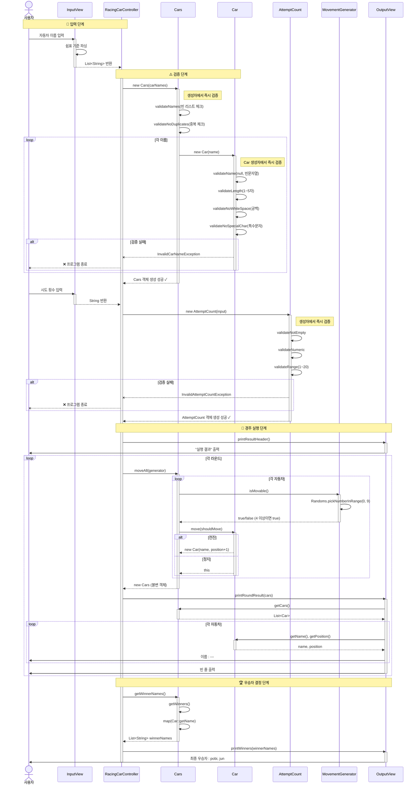
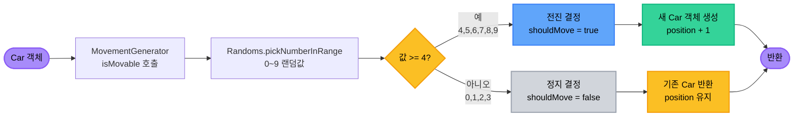
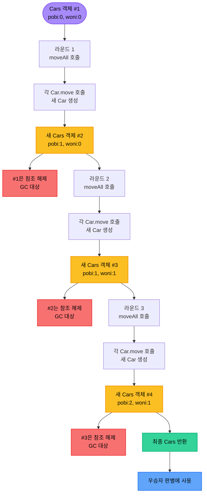
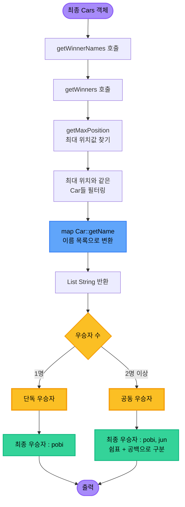

<div align="center">


</div>

<br>

## 📋 목차

<details open>
<summary>펼쳐서 전체 목차 보기</summary>

- [프로젝트 개요](#프로젝트-개요)
  - [목표](#목표)
  - [설계 의도](#설계-의도)
  - [실행 흐름](#실행-흐름)
- [기능 요구 사항](#기능-요구-사항)
- [게임 로직 플로우](#게임-로직-플로우)
  - [전체 게임 플로우차트](#전체-게임-플로우차트)
  - [계층별 상호작용](#계층별-상호작용)
  - [자동차 이동 결정 로직](#자동차-이동-결정-로직)
  - [불변 객체 패턴 흐름](#불변-객체-패턴-흐름)
  - [우승자 결정 로직](#우승자-결정-로직)
- [프로젝트 구조 설계](#프로젝트-구조-설계)
  - [패키지 구조](#패키지-구조)
  - [클래스 역할 및 책임](#클래스-역할-및-책임)
- [구현할 기능 목록](#구현할-기능-목록)
- [실행 결과 예시](#실행-결과-예시)
- [프로그래밍 요구 사항](#프로그래밍-요구-사항)
- [학습 포인트](#학습-포인트)

</details>

<br>

---

## 📋 프로젝트 개요

### 🎯 목표
주어진 횟수 동안 n대의 자동차가 전진 또는 멈추는 경주 게임을 구현하며, **객체지향 설계 원칙**과 **테스트 가능한 코드**를 작성한다.

### 🏗️ 설계 의도

<details>
<summary>상세 설계 원칙 보기 (9가지)</summary>

**1. 계층 분리 - MVC 패턴**
- `View`: 사용자 입출력 및 데이터 파싱
- `Controller`: 전체 흐름 제어
- `Domain`: 핵심 비즈니스 로직 및 검증

**2. 단일 책임 원칙**
- `Car`: 개별 자동차의 상태 및 이름 검증
- `Cars`: 자동차 컬렉션 관리 및 우승자 판별
- `AttemptCount`: 시도 횟수 검증 및 관리
- `InputView`: 사용자 입력 및 파싱
- `OutputView`: 출력 형식 및 표시
- `MovementGenerator`: 전진 여부 결정
- `RacingCarController`: 흐름 제어
- 각 클래스는 **하나의 변경 이유**만 가짐

**3. 도메인 객체의 책임 강화**
- 검증 로직을 도메인 객체 내부로 이동
- `Car`가 자신의 이름을 스스로 검증
- `Cars`가 중복 검증 수행
- `AttemptCount`가 시도 횟수를 스스로 검증
- 도메인 객체가 자신의 유효성을 보장 → 응집도 향상

**4. 일급 컬렉션 활용**
- `Cars` 클래스로 자동차 목록을 감싸서 관리
- 컬렉션 관련 비즈니스 로직(우승자 찾기, 이동 처리)을 `Cars`에 집중
- 외부에서 내부 컬렉션을 직접 조작하지 못하도록 캡슐화

**5. 불변 객체 설계**
- `Car` 객체는 이동 시 새로운 객체를 반환
- `Cars` 객체도 `moveAll()` 시 새로운 객체를 반환
- 모든 필드를 `final`로 선언하여 불변성 보장
- 예측 가능한 동작과 부작용 방지
- Garbage Collection이 사용하지 않는 객체 자동 정리

**6. 원시값 포장**
- `String` → `AttemptCount` 도메인 객체로 포장
- 타입 안전성 향상
- 검증 로직을 도메인 객체 내부에 캡슐화

**7. Tell, Don't Ask 원칙**
- Controller가 도메인 데이터를 꺼내서 가공하지 않음
- `outputView.printRoundResult(cars)` - Cars 객체를 그대로 전달
- `cars.getWinnerNames()` - Cars가 직접 우승자 이름 목록 제공
- OutputView가 Cars 객체를 받아서 내부 처리

**8. 테스트 가능한 구조**
- `MovementGenerator`를 인터페이스로 분리하여 랜덤값 테스트 가능
- `RandomMovementGenerator` - 실제 랜덤 생성
- 테스트용 고정값 생성기 구현 가능
- 각 계층을 독립적으로 테스트 가능
- 의존성 주입으로 Mock 객체 사용 가능

**9. 커스텀 예외와 타입 안전성**
- `InvalidCarNameException` - 자동차 이름 검증 실패 예외
- `InvalidAttemptCountException` - 시도 횟수 검증 실패 예외
- 모두 `IllegalArgumentException`을 상속하여 요구사항 충족
- `ErrorType` enum으로 예외 유형을 타입 안전하게 분류
- 각 ErrorType이 에러 메시지를 직접 관리
- 도메인 의도를 명확히 표현

</details>

### ⚙️ 실행 흐름
```
1. 사용자 입력
   ├─ 자동차 이름 입력 (쉼표 구분)
   │  └─ InputView에서 파싱하여 List<String> 반환
   └─ 시도 횟수 입력

2. 도메인 객체 생성 및 검증
   ├─ Cars 생성: 빈 리스트, 중복 검증
   │  └─ 각 Car 생성: 이름 검증 (null, 빈값, 길이, 공백, 특수문자)
   │     └─ 검증 실패 시 InvalidCarNameException 발생
   └─ AttemptCount 생성: 빈 입력, 숫자 형식, 범위 검증
      └─ 검증 실패 시 InvalidAttemptCountException 발생

3. 경주 진행
   ├─ playRace() 메서드 실행
   ├─ 각 라운드마다:
   │  ├─ Cars.moveAll(generator) 호출
   │  ├─ 각 Car마다 generator.isMovable() 호출
   │  ├─ 랜덤값 생성 (0~9)
   │  ├─ 4 이상이면 전진, 새 Car 객체 반환
   │  ├─ 4 미만이면 정지, 기존 Car 객체 반환
   │  ├─ 모든 Car를 모아 새 Cars 객체 생성
   │  └─ OutputView.printRoundResult(cars) 호출
   └─ 최종 Cars 객체 반환

4. 우승자 결정
   ├─ finalCars.getWinnerNames() 호출
   ├─ Cars 내부에서 최대 위치 찾기
   ├─ 최대 위치와 같은 자동차들 필터링
   ├─ Car 목록을 이름 목록으로 변환
   └─ 단독/공동 우승자 출력
```

<br>

## ✨ 기능 요구 사항

> **게임 규칙**
> - 주어진 횟수 동안 n대의 자동차는 전진 또는 멈출 수 있다.
> - 각 자동차에 이름을 부여할 수 있다. 전진하는 자동차를 출력할 때 자동차 이름을 같이 출력한다.
> - 자동차 이름은 쉼표(`,`)를 기준으로 구분하며 이름은 5자 이하만 가능하다.
> - 사용자는 몇 번의 이동을 할 것인지를 입력할 수 있어야 한다.
> - 전진하는 조건은 0에서 9 사이에서 무작위 값을 구한 후 무작위 값이 4 이상일 경우이다.
> - 자동차 경주 게임을 완료한 후 누가 우승했는지를 알려준다. 우승자는 한 명 이상일 수 있다.
> - 우승자가 여러 명일 경우 쉼표(`,`)를 이용하여 구분한다.

> **예외 처리**
>
> **자동차 이름 입력 검증**
> - **null 입력**: `null` 입력 시 `InvalidCarNameException` 발생
>   - 메시지: `[ERROR] 자동차 이름을 입력해주세요.`
> - **빈 리스트**: 빈 리스트인 경우
>   - 메시지: `[ERROR] 자동차 이름을 입력해주세요.`
> - **빈 문자열**: 빈 문자열이 포함된 경우 예: `"pobi,,jun"`
>   - 메시지: `[ERROR] 자동차 이름을 입력해주세요.`
> - **이름 길이**: 이름이 1자 미만 또는 5자를 초과하는 경우
>   - 메시지: `[ERROR] 자동차 이름의 길이가 올바르지 않습니다.`
> - **공백 포함**: 이름에 공백이 포함된 경우 예: `"po bi"`
>   - 메시지: `[ERROR] 자동차 이름에 공백을 포함할 수 없습니다.`
> - **특수문자 포함**: 한글, 영문, 숫자를 제외한 특수문자가 포함된 경우
>   - 메시지: `[ERROR] 자동차 이름은 한글, 영문, 숫자만 사용 가능합니다.`
> - **중복 이름**: 중복된 자동차 이름이 있는 경우
>   - 메시지: `[ERROR] 중복된 자동차 이름이 있습니다.`
>
> **시도 횟수 입력 검증**
> - **빈 입력**: 아무것도 입력하지 않은 경우
>   - 메시지: `[ERROR] 시도 횟수를 입력해주세요.`
> - **숫자가 아닌 값**: 시도 횟수에 숫자가 아닌 값이 입력된 경우
>   - 메시지: `[ERROR] 시도 횟수는 숫자여야 합니다.`
> - **범위 초과**: 1 미만 또는 20을 초과하는 값이 입력된 경우
>   - 메시지: `[ERROR] 시도 횟수가 규칙에 어긋납니다.`
>
> ⚠️ 예외 발생 시 애플리케이션은 종료되어야 한다.

<br>

---

## 🎮 게임 로직 플로우

### 📊 전체 게임 플로우차트

<details>
<summary>대형 플로우차트 보기</summary>



</details>

[🔝 목차로 돌아가기](#목차)

### 🔄 계층별 상호작용

<details>
<summary>시퀀스 다이어그램 보기</summary>



</details>

[🔝 목차로 돌아가기](#목차)

### 🏎️ 자동차 이동 결정 로직

<details>
<summary>이동 결정 다이어그램 보기</summary>



</details>

[🔝 목차로 돌아가기](#목차)

### 🔄 불변 객체 패턴 흐름

<details>
<summary>불변 객체 흐름 다이어그램 보기</summary>



</details>

[🔝 목차로 돌아가기](#목차)

### 🏆 우승자 결정 로직

<details>
<summary>우승자 결정 다이어그램 보기</summary>



</details>

[🔝 목차로 돌아가기](#목차)

<br>

---

## 🏗️ 프로젝트 구조 설계

### 📦 패키지 구조
```
racingcar/
├── Application.java
├── controller/
│   └── RacingCarController.java
├── domain/
│   ├── Car.java
│   ├── Cars.java
│   ├── AttemptCount.java
│   ├── MovementGenerator.java
│   ├── RandomMovementGenerator.java
│   └── exception/
│       ├── InvalidCarNameException.java
│       └── InvalidAttemptCountException.java
└── view/
    ├── InputView.java
    ├── OutputView.java
    └── messages/
        ├── InputMessage.java
        └── OutputMessage.java
```

### 🎯 클래스 역할 및 책임

<details>
<summary>상세 클래스 역할 보기</summary>

**`Application`**
- 프로그램의 시작점
- 의존성 주입
- Controller 생성 및 실행

**`controller/RacingCarController`**
- 전체 실행 흐름 제어
- View와 Domain 계층 연결
- 입력 → 도메인 생성 → 경주 진행 → 우승자 출력
- 파싱, 데이터 변환, 검증, 출력 형식 결정은 하지 않음

**`domain/Car`**
- 개별 자동차의 상태 관리: 이름, 위치
- 불변 객체: `final` 필드, 이동 시 새 객체 반환
- 이름 검증 책임:
  - null 체크
  - 빈 문자열 체크
  - 길이 체크: 1~5자
  - 공백 포함 체크
  - 특수문자 체크: 한글/영문/숫자만 허용
- 전진 로직: `move(boolean shouldMove)`
- private 생성자로 내부 상태 보장

**`domain/Cars`**
- 자동차 목록 일급 컬렉션
- 컬렉션 검증 책임:
  - 빈 리스트 체크
  - 중복 이름 체크
- 비즈니스 로직:
  - `moveAll()`: 모든 자동차 이동, 새 Cars 반환
  - `getWinners()`: 우승자 필터링
  - `getWinnerNames()`: 우승자 이름 목록 반환
  - `getMaxPosition()`: 최대 위치 계산
- 불변 컬렉션으로 외부 수정 방지

**`domain/AttemptCount`**
- 시도 횟수를 도메인 객체로 포장
- 검증 책임:
  - 빈 입력 체크
  - 숫자 형식 체크
  - 범위 체크: 1~20
- 타입 안전성 제공
- `getValue()`로 int 값 제공

**`domain/MovementGenerator`**
- 전진 여부 결정 전략 인터페이스
- `boolean isMovable()` 메서드 정의
- 테스트 가능성 확보

**`domain/RandomMovementGenerator`**
- `MovementGenerator` 구현체
- `Randoms.pickNumberInRange(0, 9)` 사용
- 4 이상일 때 true 반환
- 상수로 임계값 관리: MOVE_THRESHOLD = 4

**`domain/exception/InvalidCarNameException`**
- 자동차 이름 검증 실패 시 발생
- `IllegalArgumentException` 상속
- `ErrorType` enum: NULL, EMPTY, INVALID_LENGTH, WHITE_SPACE, SPECIAL_CHARACTER, DUPLICATE
- 각 ErrorType이 에러 메시지 관리

**`domain/exception/InvalidAttemptCountException`**
- 시도 횟수 검증 실패 시 발생
- `IllegalArgumentException` 상속
- `ErrorType` enum: EMPTY, NOT_NUMBER, OUT_OF_RANGE
- 각 ErrorType이 에러 메시지 관리

**`view/InputView`**
- 사용자 입력 담당
- 파싱 책임: 쉼표 기준으로 이름 분리 → `List<String>` 반환
- `readCarNames()`: 이름 입력 + 파싱
- `readAttemptCount()`: 횟수 입력
- `Console.readLine()`을 통한 입력 처리
- 검증은 하지 않음

**`view/OutputView`**
- 결과 출력 담당
- 출력 형식 책임:
  - `printResultHeader()`: "실행 결과" 헤더
  - `printRoundResult(Cars)`: Cars 객체를 받아서 라운드 결과 출력
  - `printCarPosition(name, position)`: 개별 자동차 위치: `이름 : ---`
  - `printRoundSeparator()`: 라운드 구분 빈 줄
  - `printWinners(List<String>)`: 우승자 목록 출력
- Tell, Don't Ask: Cars 객체를 받아서 내부 처리
- 형식 상수 관리: POSITION_DELIMITER, POSITION_MARK, NAME_SEPARATOR

**`view/messages/InputMessage`**
- 입력 관련 메시지 상수 enum
- REQUEST_CAR_NAMES, REQUEST_ATTEMPT_COUNT

**`view/messages/OutputMessage`**
- 출력 관련 메시지 상수 enum
- RESULT_HEADER, WINNERS_PREFIX

</details>

[🔝 목차로 돌아가기](#목차)

<br>

---

## 📝 구현할 기능 목록

<details>
<summary>전체 체크리스트 보기</summary>

### 1️⃣ 입력 처리
- [x] "경주할 자동차 이름을 입력하세요.(이름은 쉼표(,) 기준으로 구분)" 출력
- [x] 자동차 이름 문자열 입력 받기
- [x] 쉼표 기준 파싱하여 `List<String>` 반환
- [x] "시도할 횟수는 몇 회인가요?" 출력
- [x] 시도 횟수 입력 받기

### 2️⃣ 자동차 이름 검증
- [x] null 입력 검증
- [x] 빈 문자열 검증
- [x] 이름 길이 검증: 1~5자
- [x] 공백 포함 검증
- [x] 특수문자 포함 검증: 한글/영문/숫자만 허용
- [x] 정규식 패턴으로 검증: `^[a-zA-Z가-힣0-9]+$`

### 3️⃣ 자동차 컬렉션 검증
- [x] 빈 리스트 검증
- [x] 중복 이름 검증
- [x] HashSet으로 중복 체크
- [x] 각 이름으로 Car 객체 생성

### 4️⃣ 시도 횟수 검증
- [x] 빈 입력 검증
- [x] 숫자 형식 검증
- [x] 범위 검증: 1~20
- [x] 생성자에서 모든 검증 수행

### 5️⃣ 자동차 생성 및 관리
- [x] 자동차 초기 위치는 0
- [x] 불변 객체로 설계
- [x] 전진 시 새로운 Car 객체 반환
- [x] 정지 시 기존 Car 객체 반환
- [x] private 생성자로 내부 상태 보장
- [x] 자동차 목록을 일급 컬렉션으로 관리
- [x] 불변 리스트로 외부 수정 방지

### 6️⃣ 이동 로직
- [x] MovementGenerator 인터페이스 정의
- [x] RandomMovementGenerator 구현
- [x] 0~9 사이의 무작위 값 생성
- [x] 4 이상이면 전진
- [x] 4 미만이면 정지
- [x] 테스트 가능한 구조

### 7️⃣ 경주 진행
- [x] 주어진 횟수만큼 라운드 반복
- [x] 각 라운드마다 `Cars.moveAll(generator)` 호출
- [x] moveAll 내부에서:
  - [x] 각 Car에 대해 `generator.isMovable()` 호출
  - [x] `car.move(shouldMove)` 호출하여 새 Car 생성/유지
  - [x] 모든 Car를 모아 새 Cars 객체 생성
- [x] 최종 Cars 객체를 반환
- [x] 각 라운드 결과를 OutputView로 출력

### 8️⃣ 우승자 결정
- [x] 모든 자동차 중 최대 이동 거리 찾기
- [x] 최대 이동 거리를 가진 자동차들을 필터링
- [x] Car 목록을 이름 목록으로 변환
- [x] 우승자가 여러 명일 경우 모두 반환

### 9️⃣ 출력 처리
- [x] 빈 줄 출력 후 "실행 결과" 출력
- [x] 각 라운드별 실행 결과 출력
  - [x] Cars 객체를 받아서 처리
  - [x] 형식: `자동차이름 : -`
  - [x] 각 자동차마다 한 줄씩 출력
  - [x] 라운드 사이에 빈 줄 추가
- [x] 최종 우승자 출력
  - [x] 이름 목록을 받아서 출력
  - [x] 단독 우승: `최종 우승자 : pobi`
  - [x] 공동 우승: `최종 우승자 : pobi, jun`

### 🔟 전체 흐름
- [x] InputView에서 자동차 이름 List 받기
- [x] Cars 객체 생성
- [x] InputView에서 시도 횟수 String 받기
- [x] AttemptCount 객체 생성
- [x] 경주 진행
  - [x] 결과 헤더 출력
  - [x] 라운드 반복
  - [x] 최종 Cars 반환
- [x] 우승자 결정 및 출력
  - [x] `finalCars.getWinnerNames()` 호출
  - [x] `outputView.printWinners()` 호출
- [x] 예외 발생 시 애플리케이션 종료

</details>

[🔝 목차로 돌아가기](#목차)

<br>

---

## 💻 실행 결과 예시

### ✅ 정상 실행

<details>
<summary>정상 실행 예시 보기</summary>

```
경주할 자동차 이름을 입력하세요.(이름은 쉼표(,) 기준으로 구분)
pobi,woni,jun
시도할 횟수는 몇 회인가요?
5

실행 결과
pobi : -
woni :
jun : -

pobi : --
woni : -
jun : --

pobi : ---
woni : --
jun : ---

pobi : ----
woni : ---
jun : ----

pobi : -----
woni : ----
jun : -----

최종 우승자 : pobi, jun
```

</details>

### ❌ 예외 발생 예시

<details>
<summary>예외 발생 예시 보기</summary>

**이름 길이 초과**
```
경주할 자동차 이름을 입력하세요.(이름은 쉼표(,) 기준으로 구분)
pobi,javaji
Exception in thread "main" racingcar.domain.exception.InvalidCarNameException: [ERROR] 자동차 이름의 길이가 올바르지 않습니다.
	at racingcar.domain.Car.validateNameLength(Car.java:50)
	at racingcar.domain.Car.validateName(Car.java:30)
	at racingcar.domain.Car.<init>(Car.java:16)
	...
```

**중복 이름**
```
경주할 자동차 이름을 입력하세요.(이름은 쉼표(,) 기준으로 구분)
pobi,jun,pobi
Exception in thread "main" racingcar.domain.exception.InvalidCarNameException: [ERROR] 중복된 자동차 이름이 있습니다.
	at racingcar.domain.Cars.validateNoDuplicates(Cars.java:33)
	at racingcar.domain.Cars.<init>(Cars.java:14)
	...
```

**특수문자 포함**
```
경주할 자동차 이름을 입력하세요.(이름은 쉼표(,) 기준으로 구분)
pobi,jun@
Exception in thread "main" racingcar.domain.exception.InvalidCarNameException: [ERROR] 자동차 이름은 한글, 영문, 숫자만 사용 가능합니다.
	at racingcar.domain.Car.validateSpecialCharacter(Car.java:63)
	...
```

**잘못된 시도 횟수**
```
경주할 자동차 이름을 입력하세요.(이름은 쉼표(,) 기준으로 구분)
pobi,woni
시도할 횟수는 몇 회인가요?
abc
Exception in thread "main" racingcar.domain.exception.InvalidAttemptCountException: [ERROR] 시도 횟수는 숫자여야 합니다.
	at racingcar.domain.AttemptCount.validateNumeric(AttemptCount.java:31)
	...
```

</details>

[🔝 목차로 돌아가기](#목차)

<br>

---

## ⚙️ 프로그래밍 요구 사항

| 항목 | 요구 사항 |
|------|-----------|
| **JDK 버전** | JDK 21 |
| **시작점** | `Application`의 `main()` |
| **빌드 설정** | `build.gradle` 변경 금지 |
| **외부 라이브러리** | 제공된 라이브러리 외 사용 금지 |
| **종료 처리** | `System.exit()` 사용 금지 |
| **코드 스타일** | Java Style Guide |
| **들여쓰기** | depth 3 이하 |
| **3항 연산자** | 사용 금지 |
| **함수 길이** | 한 가지 일만 하도록 최대한 작게 |
| **입력 처리** | `camp.nextstep.edu.missionutils.Console.readLine()` 사용 |
| **랜덤 값** | `camp.nextstep.edu.missionutils.Randoms.pickNumberInRange(0, 9)` 사용 |
| **테스트** | JUnit 5와 AssertJ 사용 |

<br>

---

## 🎓 학습 포인트

### 1. 불변 객체
- final 필드로 상태 변경 방지
- 변경 시 새 객체 반환
- 예측 가능하고 안전한 코드
- GC가 자동으로 미사용 객체 정리

### 2. 단일 책임 원칙
- 한 클래스는 하나의 책임만
- 변경 이유가 하나뿐
- 높은 응집도, 낮은 결합도

### 3. Tell, Don't Ask
- 객체에게 데이터를 요청하지 말고 작업을 시켜라
- 캡슐화 강화
- 객체가 자신의 데이터를 스스로 처리

### 4. 일급 컬렉션
- 컬렉션을 감싸는 클래스
- 컬렉션 관련 로직을 한 곳에 모음
- 비즈니스 로직 캡슐화

### 5. 원시값 포장
- 원시 타입을 도메인 객체로
- 타입 안전성 향상
- 검증 로직 캡슐화

### 6. 의존성 주입
- 생성자를 통한 의존성 주입
- 테스트 용이성 확보
- 유연한 구조

### 7. 전략 패턴
- MovementGenerator 인터페이스
- 랜덤 로직을 교체 가능하게
- 테스트에서 고정값 생성기 사용 가능

[🔝 목차로 돌아가기](#목차)

<br>

<div align="center">


</div>
